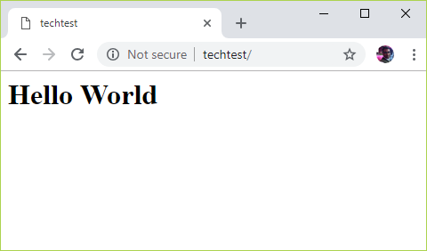

## Requirements
Please complete the following steps:
1. Create a hosted git repository account of your choice (if you do not already possess one) e.g. github, gitlab, bitbucket, etc.
2. Provide us with the account name
3. Create a public repository for this assessment and provide the name once complete
4. Use the repository for the configuration and code that will:
    1. Spin up a Linux Vagrant box of your choice
    2. Configure Vagrant to use Ansible as the provisioner
    3. Configure the box with an IP address available to the hosting OS
    4. Write playbook/playbooks to:
        1. Install and start docker
        2. Build a docker container based on the official Alpine Linux container (library/alpine:latest)
        3. Build the container so that nginx is installed and started
        4. Configure nginx to serve out some static “Hello World” content
        5. Start the container as a micro service
    5. At the end of the provisioning the URL to the web page should be available from the hosting OS
    6. Write appropriate documentation in the repository to explain how someone cloning it should provision the Vagrant VM and access the web URL serving out the “Hello World”
5. Commit as little or as often as you like
6. **For extra points write some tests using the test framework of choice (serverspec, testinfra, etc) or even simple bash/python scripts to run tests of your choice to confirm/deny that the deployment has worked**

## The solution
The assumption is that this solution is being re-created on a Windows 10 pro machine. At the time of writing this only a Windows machine was available for the dev work. The dev machine had 12GB RAM available.

### Prerequisites
- The user has admin privileges on the machine
- At least 3GB of free RAM is available on the machine. Otherwise, Vagrantfile will need editing to adjust available memory:
  - `v.customize ["modifyvm", :id, "--memory", <MEMORY_ALLOCATION>]`
- Latest version of Oracle VM VirtualBox
- Latest version of Git for Windows
- Latest version of Vagrant
  - Install Vagrant Host Manager plugin by running `vagrant plugin install vagrant-hostmanager` in Git Bash terminal. This will update host files on both guest and host machines
  - Install vagrant-vbguest plugin: `vagrant plugin install vagrant-vbguest`. See the comments in [Vagrantfile](./Vagrantfile) regarding shared folders.

### Instructions
1. Clone this repo and change the directory: `git clone https://github.com/shazChaudhry/tech_test.git && cd tech_test`
1. Launch the guest machine: `clear && vagrant up --color`
2. Should you have a need to SSH to the box _(e.g. troubleshooting)_, then run `vagrant ssh` command

### Testing
The web URL serving out the “Hello World” should be accessible at [http://techtest](http://techtest)

Once the statice content has been visually confirmed, you can then test individual ansible roles. Please see Molecule instructions in [README under ansible](./ansible/README.md) directory for infrastructure testing from a user's perspective

### Clean up
Once finished, change the directory in Git Bash terminal to where this repo was cloned and run `vagrant destroy --force`

## Improvements to the solution architecture
1. It has not been explained to me and so, I am not entirely sure what this challange is trying to test. However, in my oppinion the requirements should cerntainly be reviewed if the end goal simply is to:
    - install docker on a vagrant guest machine
    - build & run an alpine based docker container

1. In this scenario, the entire solution could be much simpler and would require significantly less effort by removing Ansible from the solution architecture:
    - The [docker provisioner](https://www.vagrantup.com/docs/provisioning/docker.html) can automatically install Docker, pull Docker containers, and configure certain containers to run on boot
    - See this alternative [vagrant configuration](./Vagrantfile_docker) that you could run as follows without having to use Ansible:
      - `clear && vagrant destroy --force && VAGRANT_VAGRANTFILE=Vagrantfile_docker vagrant up --color`
      - This alternative vagrantfile demonstrates that the same result as above can be achieved with ease and significantly reduced complexity and effort
    - The web URL serving out the “Hello World” should still be accessible at [http://techtest](http://techtest)

1. Also, is vagrant really needed if docker can be run natively on a machine?

## References
1. Get started with [Ansible](https://www.ansible.com/resources/get-started) which is an app deployment, configuration management, and orchestration tool
2. Get Started with [Docker](https://www.docker.com/get-started) which is a container solution
1. [Oracle VM VirtualBox](https://www.virtualbox.org/wiki/Downloads) is a free and open-source hosted hypervisor for x86 computers
1. [Git for Windows](https://git-scm.com/downloads) provides a BASH emulation used to run Git from the command line. *NIX users should feel right at home, as the BASH emulation behaves just like the "git" command in LINUX and UNIX environments
1. [Vagrant](https://www.vagrantup.com/intro/getting-started/install.html) is an open-source software product for building and maintaining portable virtual software development environments, e.g. for VirtualBox, Hyper-V, Docker containers, etc.
1. [Molecule](https://molecule.readthedocs.io/en/latest/) is designed to aid in the development and testing of Ansible roles. Molecule provides support for testing with multiple instances, operating systems and distributions, virtualization providers, test frameworks and testing scenarios. Molecule is opinionated in order to encourage an approach that results in consistently developed roles that are well-written, easily understood and maintained. Molecule uses Ansible playbooks to exercise the role and its associated tests. Molecule supports any provider that Ansible supports.
1. [Testing ansible roles with molecule, goss and docker](http://linora-solutions.nl/post/testing_ansible_roles_with_molecule_goss_and_docker/)
1. [Goss](https://github.com/aelsabbahy/goss) is a YAML based serverspec alternative tool for validating a server’s configuration. It eases the process of writing tests by allowing the user to generate tests from the current system state. Once the test suite is written they can be executed, waited-on, or served as a health endpoint.
1. [Testing Ansible roles with Molecule](https://opensource.com/article/18/12/testing-ansible-roles-molecule). Learn how to automate your verifications using Python
1. With [Testinfra](https://testinfra.readthedocs.io/en/latest/) you can write unit tests in Python to test actual state of your servers configured by management tools like Salt, Ansible, Puppet, Chef and so on. Testinfra aims to be a Serverspec equivalent in python and is written as a plugin to the powerful Pytest test engine
